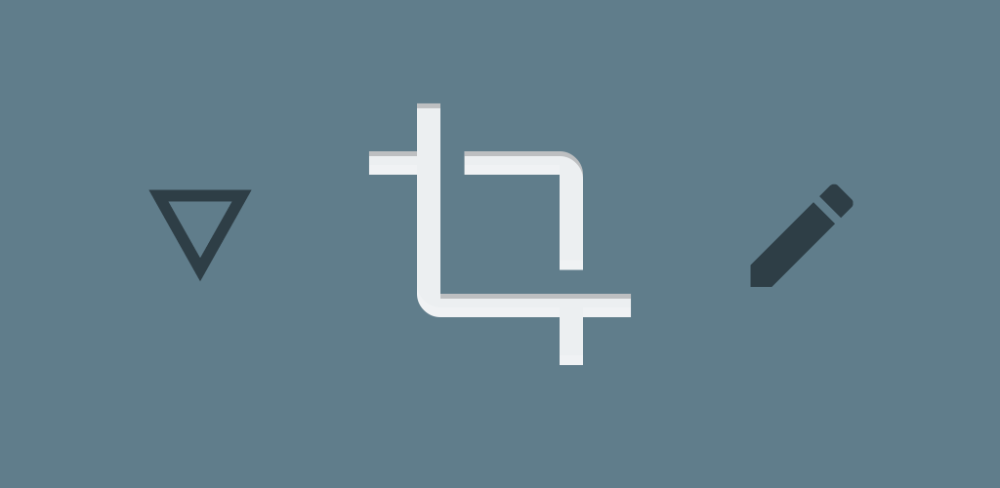

Enhanced Screenshot Notification - Help
====

Here I only show frequent asked questions. If you are meeting some bugs, please [create an issue](https://github.com/fython/EnhancedScreenshotNotification/issues/new) in this repository.

Needs other languages? [简体中文 (zh-CN)](./.github/HELP_zh_CN.md)

## Q: How to use this app?

0. This app supports only Android 7.0+ currently.
1. Install [Nevolution app](https://play.google.com/store/apps/details?id=com.oasisfeng.nevo). This app is just a decorator plug-in.
2. Install this app. You can get prebuilt package from GitHub Releases and Google Play. If you have development environment, you can compile your own package.
3. Open Nevolution and activate this app for "System UI". If your Android ROM's screenshot notification isn't sent from these packages, please tell me for adding support:
    - `com.android.systemui` (AOSP and most ROMs)
    - `com.oneplus.screenshot` (OnePlus ROM)
    - `com.samsung.android.app.smartcapture` (Samsung ROM)
4. Grant storage permission for Enhanced Screenshots Notification in order that it can get your latest screenshot's path. If you don't do that, most functions cannot work.
5. Enhanced Screenshots Notification should be working now. You can set up your preferences in ESN's settings.

## Q: Where can I donate author?

If you think my app is very useful and you're glad to help me, you can donate me via Alipay (支付宝): `fythonx#gmail.com` (Replace `#` with `@`)

Paypal is also acceptable but it will deduct a lot of fees so I recommend to use Alipay instead. Paypal: [paypal.me/fython](https://paypal.me/fython)

## Q: I granted storage permission for ENS, but it still doesn't provide **Edit** action for screenshot notification. Why?

Firstly, read the first question that about how to install properly.

Check if your ROM's default screenshot path is `<External Storage>/Pictures/Screenshots`. If not, change ENS settings to correct path.

## Q: Can I directly edit screenshot by specified app instead of choosing editors every time?

Yes. Go to ENS Settings and set your preferred editor.

## Q: Can I customize screenshot sound?

No. Its sound is specified by system.

## Q: How to use floating preview?

First, **ensure your Android version is 8.0+**. It depends PiP API which is supported only in Android 8.0+.

Enable settings and choose if show floating preview automatically instead of notifcation. Notification will not dismiss completely, but its priority is set to minimum level.

# For developers

## Q: Can I contribute on this project?

Of course. I am glad to work with other developers together.

If you fix some bugs, relax and send a pull request directly.

If you want to add / change some features, please create an issue / contact me for a discussion before sending PRs.
