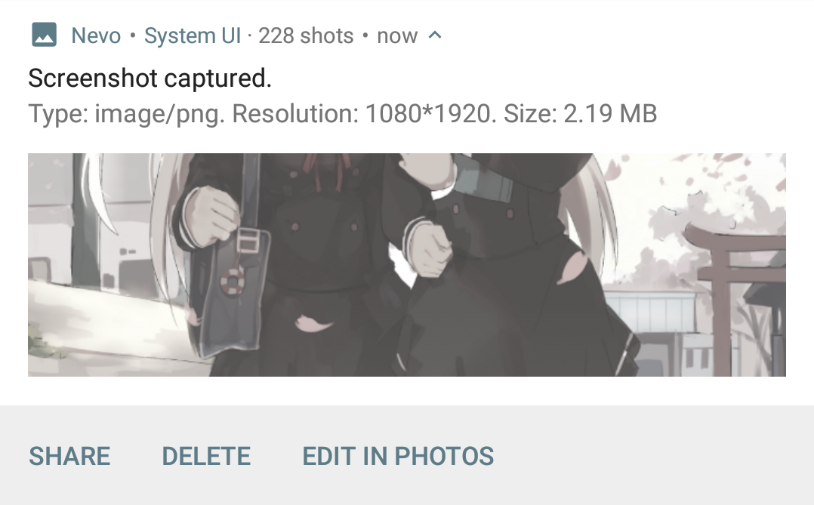

Enhanced Screenshot Notification (Nevolution Decorator)
====

# Introduction

Enhance screenshot notification then you can start to edit screenshot quickly.

> This feature is implemented in Android P & some third-party ROMs.

# Requirements

## For users

- Android 7.0+
- A normal Android ROM
- Grant this app to read external storage for accessing latest screenshot.

## For developers

- Android SDK 27
- Android Studio 3.3
- Gradle 4.8

# TO-DO

Just a try to use [Nevolution app](https://play.google.com/store/apps/details?id=com.oasisfeng.nevo) to enhance notifications. I make this for my own requirement. So it won't be maintained for a long time.

- [x] "Edit" action
- [x] Dismiss evolved notification after clicking "Delete" action
- [ ] Multilanguage
- [ ] Stable dismiss behavior
- [ ] Settings interface
- [ ] Support older Android version

# Contact me

Telegram: [@fython](https://t.me/fython)

# License

